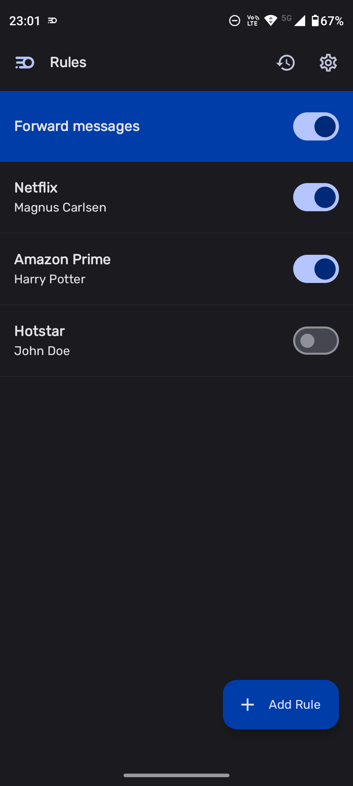
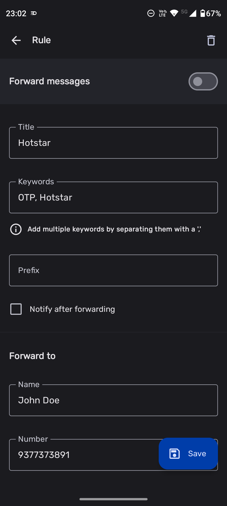
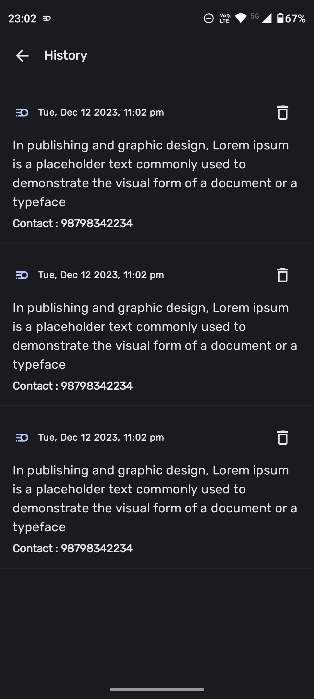

# AutOTP (WIP)

AutOTP is an automated message forwarding app built using Kotlin and Compose. It features an nice
user interface and supports Material 3 content based [dynamic theming](https://m3.material.io/styles/color/dynamic-color/user-generated-color).

## Screenshots

<p style="text-align: center;">
  
  
  
</p>

## Features ✨

- Forward messages filtered by keywords
- Toggle to enable/disable all or individual rules
- History of messages forwarded
- Prefix to appended to the forwarded message

## Tech Stack 📚

- [Jetpack Compose](https://developer.android.com/jetpack/compose)
- [HILT Android](https://dagger.dev/hilt)
- [Room DB](https://developer.android.com/jetpack/androidx/releases/room)
- [Kotlin Coroutines](https://github.com/Kotlin/kotlinx.coroutines)
- [Jetpack Navigation](https://developer.android.com/guide/navigation)

## Development 🛠️

You can just clone the repo and build it locally without requiring any changes.

## Contributing 🛠️

You can contribute bug fixes to the project via PRs, for anything else open an issue to start a conversation.

## Made by ❤️

- [Swapnil Kadlag](https://github.com/swapnilkadlag) / Development

## License

```
Copyright Swapnil Kadlag

Licensed under the Apache License, Version 2.0 (the "License");
you may not use this file except in compliance with the License.
You may obtain a copy of the License at

    https://www.apache.org/licenses/LICENSE-2.0

Unless required by applicable law or agreed to in writing, software
distributed under the License is distributed on an "AS IS" BASIS,
WITHOUT WARRANTIES OR CONDITIONS OF ANY KIND, either express or implied.
See the License for the specific language governing permissions and
limitations under the License.
```